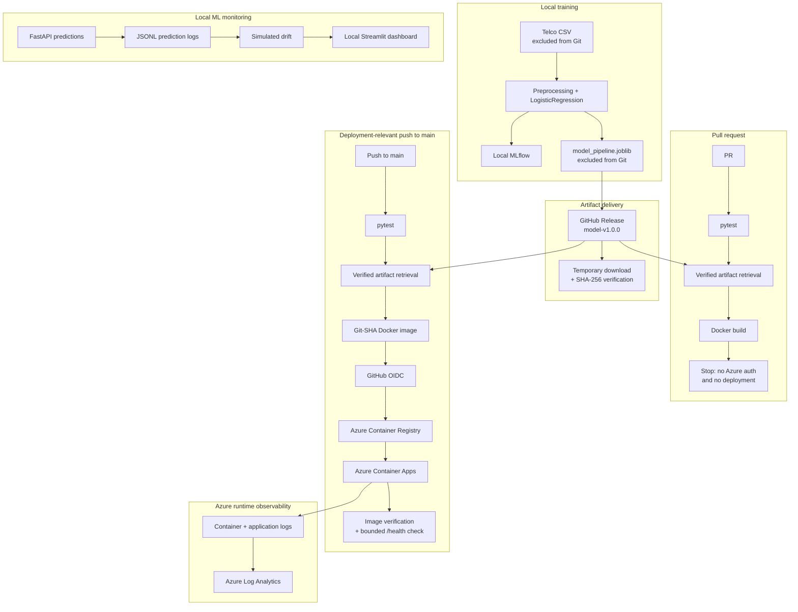

# MLOps Customer Churn Prediction & Drift Monitoring Platform

End-to-end ML engineering project taking a scikit-learn churn model from reproducible training to a verified model release, containerised FastAPI serving, automated Azure deployment and monitoring evidence.

This is a portfolio cloud-hosted deployment built with public data, synthetic monitoring traffic and synthetic benchmark requests. It is not a real customer system or an SLA-backed service.

[](https://github.com/KangLi5685752/mlops-customer-churn-platform/actions/workflows/ci.yml)
[](https://github.com/KangLi5685752/mlops-customer-churn-platform/actions/workflows/azure-deploy.yml)

[`Python`](https://www.python.org/) · [`scikit-learn`](https://scikit-learn.org/) · [`FastAPI`](https://fastapi.tiangolo.com/) · [`Docker`](https://www.docker.com/) · [`MLflow`](https://mlflow.org/) · [`GitHub Actions`](https://github.com/features/actions) · [`Azure Container Apps`](https://azure.microsoft.com/products/container-apps) · [`Azure Container Registry`](https://azure.microsoft.com/products/container-registry)

[CI workflow](.github/workflows/ci.yml) · [Azure deployment workflow](.github/workflows/azure-deploy.yml) · [Model release `v1.0.0`](https://github.com/KangLi5685752/mlops-customer-churn-platform/releases/tag/model-v1.0.0) · [Model card](reports/model_card.md) · [Decision log](DECISIONS.md)

## Key Outcomes

| Model quality | Engineering quality | Hosted API evidence | Cloud delivery |
| --- | --- | --- | --- |
| **0.842** held-out ROC-AUC | **42** automated tests passing | **100/100** synthetic requests, **62.0 ms p95** | OIDC-based CI/CD to Azure Container Apps |

Hosted latency is client-observed end-to-end public-HTTPS evidence, not pure model inference latency or an SLA measurement.

## Architecture



MLflow, prediction logging, simulated drift and Streamlit run locally. Azure hosts the FastAPI container and runtime logs; the raw dataset is not present in the runtime image. A polished reusable architecture graphic is planned as a later portfolio asset.

[Detailed architecture and execution boundaries](docs/architecture.md)

## What Was Built

- **Reproducible ML training:** reusable [data](src/data/), [preprocessing](src/features/) and [training/evaluation](src/models/) modules with a fixed held-out split and local MLflow tracking.
- **Model serving:** [FastAPI application](app/) with Pydantic validation, `GET /health` and `POST /predict`.
- **Testing and containerisation:** 42 pytest tests, Docker packaging and pull-request Docker build validation.
- **Artifact provenance:** published `model-v1.0.0` release, machine-readable [deployment manifest](deployment/model_artifact.json) and checksum-gated retrieval before installation.
- **CI/CD:** cloud-write-free pull-request validation plus automated deployment-relevant `main` pushes using OIDC and resource-scoped RBAC.
- **Monitoring and observability:** local prediction logging, synthetic traffic, simulated drift, a Streamlit dashboard and separate Azure Log Analytics runtime evidence.

## Model Performance

The public Telco Customer Churn dataset contains 7,043 records and 19 model features after removing the identifier and target. Evaluation uses a fixed 1,409-record held-out test split.

| Model | ROC-AUC | Accuracy | Precision | Recall | F1 |
| --- | ---: | ---: | ---: | ---: | ---: |
| DummyClassifier | 0.5000 | 0.7346 | 0.0000 | 0.0000 | 0.0000 |
| LogisticRegression | **0.8419** | **0.8055** | **0.6572** | **0.5588** | **0.6040** |

The fitted pipeline improves substantially over the dummy baseline. Accuracy alone is insufficient because churn is imbalanced; recall and precision remain moderate, so false negatives and false positives remain meaningful limitations.

[Model and data details](docs/model_and_data.md) · [Evaluation report](reports/evaluation_summary.md) · [Model card](reports/model_card.md)

## Cloud Deployment and CI/CD

### Pull Requests

```text
pytest
-> pinned artifact retrieval
-> SHA-256 verification
-> Docker build
-> no Azure authentication
-> no deployment
```

Pull requests validate code, artifact integrity and container construction without Azure deployment permissions.

### Main Deployment

```text
deployment-relevant push to main
-> pytest
-> verified artifact retrieval
-> Docker build
-> GitHub OIDC login
-> temporary ACR authentication
-> immutable Git-SHA image push
-> Azure Container Apps update
-> deployed-image verification
-> bounded HTTPS /health validation
```

The deployment workflow uses OIDC federation instead of a long-lived Azure client secret. Access is resource-scoped, and the ACR admin user is not used. Documentation-only and test-only changes do not trigger Azure deployment.

[CI workflow](.github/workflows/ci.yml) · [Azure deployment workflow](.github/workflows/azure-deploy.yml) · [Azure deployment evidence and guardrails](docs/azure_deployment_plan.md)

## Monitoring and Observability

### Local ML Monitoring

- Successful local predictions append selected fields to a Git-ignored JSONL log.
- Synthetic traffic exercises the real FastAPI prediction path.
- Deterministic numerical and categorical shifts produce simulated drift evidence.
- A local Streamlit dashboard presents prediction summaries and drift tables.

### Azure Runtime Observability

- Azure Container Apps logs confirmed image pull, container creation and application startup.
- Console logs captured successful `/health`, synthetic `/predict` and `/docs` requests.
- Persistent runtime evidence was queried through Azure Log Analytics.

The local drift workflow is simulated and does not run automatically in Azure. Azure runtime logs do not constitute production model-performance monitoring.

[Monitoring workflow](docs/monitoring.md) · [Simulated drift report](reports/drift_detection_summary.md)

## Performance Evidence

Both benchmarks used 100 sequential synthetic `POST /predict` requests.

| Environment | Successful requests | Average | p50 | p95 |
| --- | ---: | ---: | ---: | ---: |
| Local API | 100/100 | 9.815 ms | 9.376 ms | 12.205 ms |
| Azure-hosted API | 100/100 | 56.947 ms | 55.676 ms | 61.961 ms |

The Azure-hosted minimum was 53.788 ms and maximum was 98.342 ms. Measurement began after readiness validation and five successful unmeasured warm-up requests.

The hosted result is client-observed end-to-end latency and may include workstation handling, public networking, HTTPS, Azure ingress, FastAPI, preprocessing, inference and response transmission. The local and hosted environments have different boundaries, so their difference must not be interpreted as Azure overhead.

[Local benchmark report](reports/api_latency_benchmark.md) · [Azure-hosted benchmark report](reports/azure_api_latency_benchmark.md)

## Engineering Decisions

1. **Persist preprocessing with the model.** The saved artifact contains the fitted transformer and `LogisticRegression` pipeline used by inference.
2. **Keep generated artifacts outside Git.** Deployment retrieves the pinned release asset and verifies SHA-256 before installation or use.
3. **Keep pull requests cloud-write-free.** PR CI validates pytest, artifact retrieval and Docker build without Azure authentication.
4. **Use federated deployment identity.** GitHub Actions uses OIDC and resource-scoped RBAC instead of a long-lived Azure client secret.
5. **Use immutable image references.** Deployment images use Git-SHA tags and the configured Container App image is independently verified.

[Full decision log](DECISIONS.md)

## Limitations and Responsible Use

- The dataset is public, static and may not represent current or organisation-specific customer populations.
- Recall and precision are moderate; predictions can produce both false negatives and false positives.
- There is no real customer production traffic or validated retention uplift.
- Prediction traffic, drift inputs and benchmark requests are synthetic.
- Drift detection uses demonstration thresholds and no ground-truth outcomes.
- Hosted latency is not a load test, stress test, pure inference benchmark or SLA evidence.
- Churn scores are decision support and must not automatically determine customer treatment.

[Model card](reports/model_card.md) · [Risk register](reports/risk_register.md)

## Quickstart

Run commands from the repository root with Python 3.10.

1. Install dependencies:

   ```bash
   python -m pip install -r requirements.txt
   ```

2. Place the Git-ignored Telco CSV at:

   ```text
   data/raw/WA_Fn-UseC_-Telco-Customer-Churn.csv
   ```

3. Run tests, train and evaluate:

   ```bash
   python -m pytest
   python -m src.models.train
   python -m src.models.evaluate
   ```

4. Start the API:

   ```bash
   python -m uvicorn app.main:app --reload
   ```

   Open `http://127.0.0.1:8000/docs`.

5. Build and run the container after the model artifact exists:

   ```bash
   docker build -t mlops-customer-churn-api .
   docker run --rm -p 8000:8000 mlops-customer-churn-api
   ```

Artifact retrieval, MLflow, API payloads, monitoring commands and CI/CD details are documented in the [MLOps workflow](docs/mlops_workflow.md).

## Repository Structure

```text
app/                  FastAPI inference service and schemas
dashboard/            Local Streamlit monitoring dashboard
deployment/           Versioned model artifact manifest
docs/                 Architecture and operational documentation
notebooks/            Baseline experiment
reports/              Committed model, risk, drift and benchmark evidence
scripts/              Artifact, traffic, drift and benchmark commands
src/                  Reusable data, feature, model and monitoring modules
tests/                Synthetic and mocked pytest coverage
.github/workflows/    CI, OIDC smoke test and Azure deployment workflows
```

## Documentation and Evidence

- [System architecture](docs/architecture.md)
- [Model and data](docs/model_and_data.md)
- [MLOps workflow](docs/mlops_workflow.md)
- [Monitoring and observability](docs/monitoring.md)
- [Azure deployment plan and validated evidence](docs/azure_deployment_plan.md)
- [Azure teardown checklist](docs/azure_teardown_checklist.md)
- [Model card](reports/model_card.md)
- [Risk register](reports/risk_register.md)
- [Local API benchmark](reports/api_latency_benchmark.md)
- [Azure-hosted API benchmark](reports/azure_api_latency_benchmark.md)
- [Decision log](DECISIONS.md)
