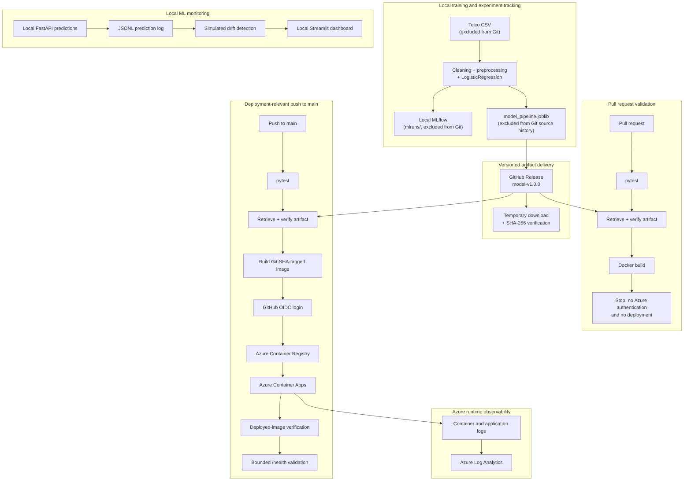

# System Architecture

This project separates model training, artifact delivery, inference serving, CI/CD, local ML monitoring and Azure runtime observability. The Azure deployment is a portfolio cloud-hosted validation using synthetic requests, not a production customer workload.

## End-to-End Flow

A polished reusable architecture graphic is planned as a later portfolio asset. This Mermaid diagram is the current repository-native representation.

## Execution Boundaries

| Boundary | Runs there | Does not run there |
| --- | --- | --- |
| Local workstation | Dataset-backed training, evaluation, local MLflow, prediction logging, simulated drift and Streamlit | No automatic Azure provisioning |
| GitHub Actions pull request | Tests, pinned artifact retrieval, SHA-256 verification and Docker build | No Azure authentication, image push or deployment |
| GitHub Actions main deployment | Tests, verified artifact retrieval, Docker build, OIDC login, immutable image push and deployment validation | No model retraining and no raw dataset |
| Azure | ACR image storage, Container Apps inference and Log Analytics runtime evidence | No local MLflow, Streamlit dashboard or simulated drift workflow |

## Training and Artifact Boundary

[`src/models/train.py`](../src/models/train.py) loads the local raw dataset, builds the full preprocessing and `LogisticRegression` pipeline, evaluates it on a fixed held-out split and writes `artifacts/model_pipeline.joblib`. Local experiment metadata is recorded under `mlruns/`.

The raw dataset, local MLflow store and binary model artifact are excluded from Git. The published `model-v1.0.0` release provides the deployment artifact separately from source history. [`deployment/model_artifact.json`](../deployment/model_artifact.json) records its provenance, runtime compatibility and authoritative SHA-256.

[`scripts/fetch_model_artifact.py`](../scripts/fetch_model_artifact.py) downloads the pinned release asset to a temporary location, verifies its checksum and installs it at the runtime path only after verification succeeds. The artifact is SHA-256 verified, not cryptographically signed or attested.

## Serving Boundary

[`app/main.py`](../app/main.py) loads the saved pipeline and exposes `GET /health` and `POST /predict`. Training is not part of API startup or Docker image construction. The Docker image contains the verified artifact and inference code, but not the raw CSV.

The same FastAPI serving application is validated locally, in Docker and as a cloud-hosted portfolio deployment in Azure Container Apps.

## CI/CD Boundary

The [CI workflow](../.github/workflows/ci.yml) runs on pushes and pull requests. Pull requests additionally retrieve and verify the pinned model artifact and validate the Docker build without receiving Azure deployment capability.

The [Azure deployment workflow](../.github/workflows/azure-deploy.yml) runs manually or on deployment-relevant pushes to `main`. It uses GitHub OIDC federation, temporary ACR authentication, immutable Git-SHA image tags, deployed-image verification and a bounded HTTPS health check. Azure access is resource-scoped; the workflow does not use a long-lived Azure client secret or the ACR admin user.

## Monitoring and Observability Boundary

Local prediction logging, synthetic traffic, simulated drift and the Streamlit dashboard demonstrate an ML monitoring workflow without claiming production drift. Azure Container Apps and Log Analytics provide separate runtime evidence for image pull, container lifecycle, application startup and successful endpoint requests.

See [Monitoring and Observability](monitoring.md) for the local workflow and [Azure Deployment Plan](azure_deployment_plan.md) for validated cloud details and guardrails.
